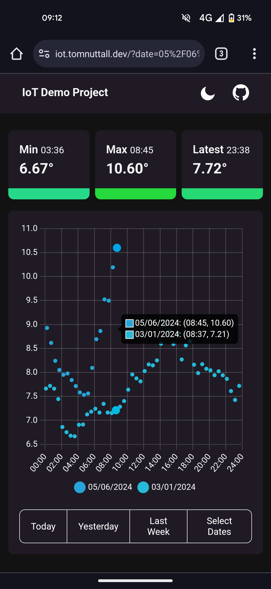

# IoT Temp Sensor

IoT device with a temperature sensor sends readings that can then be viewed with a dashboard.

<div>
  
  
</div>
  
## Project Overview

### :sun_behind_small_cloud: Temperature Sensor

> :book: [Data Source Readme](/microcontroller/README.md)

- Esp32 microcontroller connected to a temperature sensor.
- Average Reading sent to AWS IoT Core and message added to DynamoDB table.

### 🛠️ AWS Backend

> :book: [Backend Readme](/backend/README.md)

- API Gateway with Lambda integration reads DynamoDB table and returns data.

### 📈 React Frontend

> :book: [Dashboard Readme](/dashboard/README.md)

- React dashboard consumes API with date picking.
- ChartJS used for graphs.

### :bricks: Infastructure

> :book: [Infastructure Readme](/infastructure/README.md)

- CloudFormation templates used to deploy AWS infastructure
- GitHub actions deploy dashboard to S3 bucket and backend lambda.

### :bricks: Local DB

> :book: [Local DB Readme](/local-db/README.md)

- Docker image for local DynamoDB tables.

## Run

1. Start up (and populate) local DynamoDB docker image
2. Start up local lambda and connect to local DynamoDB table

```
yarn dev:local-db
yarn dev:backend
```

3. Start frontend and connect to local backend.

```
yarn dev:dashboard
```
