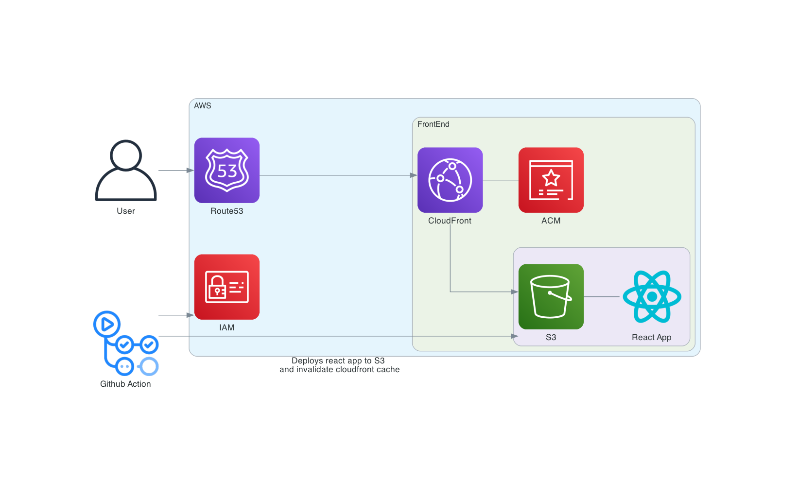

# Infastructure

## Overview

- CloudFormation templates used to deploy infastructure on AWS.
  - Cloudfront-cert must be used on us-east-1 region.
- DynamoDB Schema
  - Partion key is date hash key and timestamp sort key.
- GitHub action runs on push to main branch.
  1. deploy-frontend runs on change to dashboard folder
  - Builds frontend, runs unit tests then deploys to S3 Buckets.
  - Creates cloudfront invalidation on index.html after deploying to s3 bucket.
  2. deploy-backend runs on change to backend folder
  - Runs lambda unit tests then deploys Lambda.

## Architecture Diagram

Backend

Frontend

